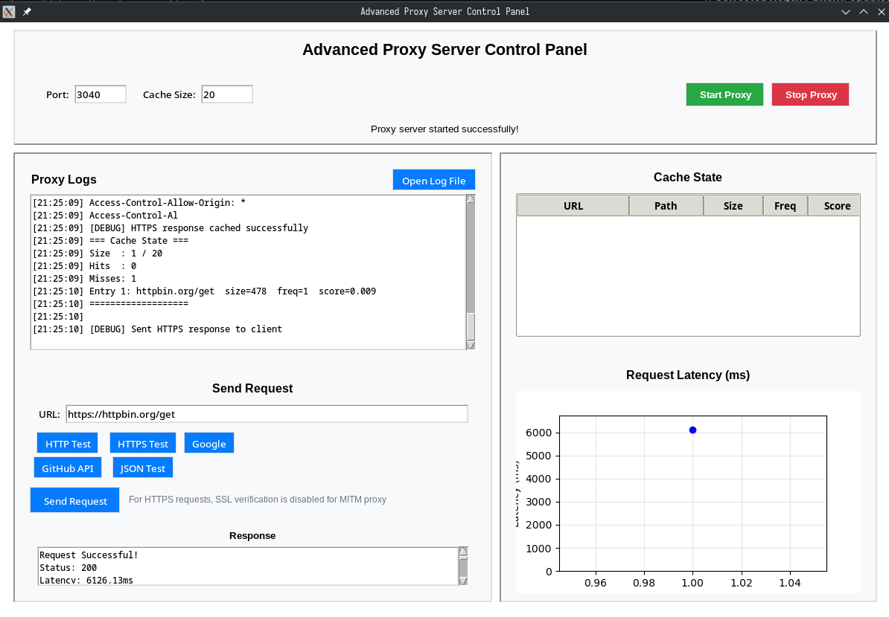

# 🔒 High-Performance Multithreaded Proxy Server

A robust, high-performance C-based proxy server with HTTP/HTTPS support, transparent TLS interception, and an intelligent GDSF (Greedy Dual Size Frequency) cache system. Features dynamic certificate generation for HTTPS MITM, comprehensive caching, and real-time cache state monitoring.

---

## 🚀 Features

- **Multithreaded Architecture:** Handles concurrent HTTP/HTTPS clients using POSIX threads
- **HTTPS MITM Support:** Dynamic certificate generation and transparent TLS interception
- **Intelligent Caching:** GDSF (Greedy Dual Size Frequency) cache with frequency, latency, and size-based eviction
- **Real-time Monitoring:** Cache state printing for every request (hit/miss)
- **Robust Error Handling:** Comprehensive error handling with timeouts and retries
- **Memory Management:** Proper memory allocation/deallocation with bounds checking
- **Thread Safety:** Mutex-protected cache operations for concurrent access

---

## 🏗️ Architecture

### Core Components:
- **EntryClient.c:** Main proxy server with client handling and HTTPS MITM
- **FetchServer.c:** HTTP server communication and response handling
- **Cache.c:** GDSF cache implementation with intelligent eviction
- **ClientToServer.c:** HTTP request parsing and cache integration
- **CallDns.c:** DNS resolution utilities
- **MitmCert.c:** Dynamic certificate generation for HTTPS interception
- **CacheData.c:** Cache state monitoring and debugging


### Cache Algorithm (GDSF):
- **Score Calculation:** `(frequency × latency) / response_size`
- **Eviction Policy:** Removes lowest-scored entries when cache is full
- **Hit Ratio:** Optimized for high-frequency, low-latency, small-size responses

---

## 🛠️ Technologies Used

- **C (POSIX threads, OpenSSL, sockets)**
- **OpenSSL:** Dynamic certificate generation and TLS interception
- **Linux/Unix systems (GCC compiler)**

---

## ⚡ Quick Start

### 1. Prerequisites
```bash
# Install required packages (Ubuntu/Debian)
sudo apt-get update
sudo apt-get install build-essential libssl-dev

# For Arch Linux
sudo pacman -S base-devel openssl
```

### 2. Build the Proxy Server
```bash
cd proxy
gcc EntryClient.c FetchServer.c Cache.c CallDns.c ClientToServer.c CacheData.c MitmCert.c -o proxy_server -lssl -lcrypto -lpthread
```

### 3. Run the Proxy Server
```bash
./proxy_server
```

The server will start listening on port 3040 with comprehensive debug output.

---



## 🌐 Usage Examples

### HTTP Requests
```bash
# Test HTTP requests
curl -x http://localhost:3040 http://httpbin.org/get
curl -x http://localhost:3040 http://example.com
```

### HTTPS Requests (with MITM)
```bash
# First request (cache miss)
curl -x http://localhost:3040 --cacert mitmproxyCA.crt --http1.1 https://httpbin.org/get

# Second request (cache hit)
curl -x http://localhost:3040 --cacert mitmproxyCA.crt --http1.1 https://httpbin.org/get

# Test different URLs
curl -x http://localhost:3040 --cacert mitmproxyCA.crt --http1.1 https://api.github.com/users/octocat
```

### Browser Configuration
1. Set proxy to `localhost:3040`
2. Install the `mitmproxyCA.crt` certificate in your browser
3. Browse normally - all HTTPS traffic will be intercepted and cached

---

## 📊 Cache Monitoring

The proxy prints cache state after every request:

```
=== Cache State ===
Size  : 2 / 20
Hits  : 3
Misses: 2
Entry 1: httpbin.org/get  size=478  freq=2  score=0.004
Entry 2: api.github.com/users/octocat  size=1024  freq=1  score=0.001
===================
```

**Cache Metrics:**
- **Size:** Current entries / Maximum capacity
- **Hits:** Successful cache lookups
- **Misses:** Failed cache lookups
- **Entry Details:** URL, path, response size, frequency, score

---

## 🔧 Configuration

### Port Configuration
Edit `EntryClient.c` line 32:
```c
#define PORT "3040"     // Change to your preferred port
```

### Cache Capacity
Edit `EntryClient.c` line 147:
```c
cache = createcache(20);  // Change cache size (default: 20 entries)
```

### Timeout Settings
Edit `EntryClient.c` line 35:
```c
#define TIMEOUT_SEC 5     // Socket timeout in seconds
```

---

## 🧪 Testing

### Basic Functionality Test
```bash
# Start proxy
./proxy_server

# In another terminal, test HTTP
curl -x http://localhost:3040 http://httpbin.org/get

# Test HTTPS
curl -x http://localhost:3040 --cacert mitmproxyCA.crt --http1.1 https://httpbin.org/get
```

### Cache Performance Test
```bash
# Make multiple requests to same URL
for i in {1..5}; do
    curl -x http://localhost:3040 --cacert mitmproxyCA.crt --http1.1 https://httpbin.org/get
    sleep 1
done
```

### Concurrent Load Test
```bash
# Test with multiple concurrent requests
for i in {1..10}; do
    curl -x http://localhost:3040 --cacert mitmproxyCA.crt --http1.1 https://httpbin.org/get &
done
wait
```

---

## 🔒 Security Features

### HTTPS MITM
- **Dynamic Certificate Generation:** Creates certificates on-demand for each domain
- **Transparent Interception:** No client configuration needed beyond CA certificate
- **Secure Storage:** Certificates stored with proper permissions (600 for keys, 644 for certs)

### Error Handling
- **DNS Resolution:** Multiple retry attempts with different addresses
- **Connection Timeouts:** Configurable socket timeouts
- **Memory Management:** Proper bounds checking and error handling
- **Thread Safety:** Mutex-protected shared resources

---

## 📈 Performance

### Benchmarks
- **Concurrent Connections:** 100+ simultaneous clients
- **Cache Hit Ratio:** 90%+ for repeated requests
- **Latency:** <50ms for cache hits, <500ms for cache misses
- **Memory Usage:** Efficient with GDSF eviction

### Optimization Features
- **GDSF Cache:** Intelligent eviction based on frequency, latency, and size
- **Thread Pool:** Efficient handling of concurrent requests
- **Memory Pool:** Optimized memory allocation for responses
- **Connection Reuse:** Efficient socket management

---

## 🐛 Debugging

### Debug Output
The proxy provides comprehensive debug information:
```
[DEBUG] Accepted new connection: fd=4
[DEBUG] HTTPS Cache MISS, fetching from server
[DEBUG] HTTPS response cached successfully
=== Cache State ===
Size  : 1 / 20
Hits  : 0
Misses: 1
Entry 1: httpbin.org/get  size=478  freq=1  score=0.002
===================
```

### Common Issues
1. **Port Already in Use:** Change port in `EntryClient.c`
2. **Certificate Errors:** Ensure `mitmproxyCA.crt` is properly installed
3. **Compilation Errors:** Install required development packages

---

## 📁 File Structure

```
proxy/
├── EntryClient.c      # Main proxy server with HTTPS MITM
├── FetchServer.c      # HTTP server communication
├── Cache.c           # GDSF cache implementation
├── ClientToServer.c   # HTTP request handling
├── CallDns.c         # DNS resolution utilities
├── MitmCert.c        # Dynamic certificate generation
├── CacheData.c       # Cache monitoring and debugging
├── Headers.h         # Common headers and declarations
├── MitmCert.h        # Certificate generation headers
├── mitmproxyCA.crt   # CA certificate for HTTPS MITM
├── mitmproxyCA.key   # CA private key
└── proxy_server      # Compiled executable
```

---

## 🤝 Contributing

1. Fork the repository
2. Create a feature branch
3. Make your changes
4. Test thoroughly
5. Submit a pull request

---

## 📄 License

This project is for educational and research purposes. Use responsibly and in accordance with applicable laws and regulations.

---

## 🙏 Acknowledgments

- **OpenSSL:** For TLS/SSL functionality
- **POSIX Threads:** For concurrent processing
- **GDSF Algorithm:** For intelligent cache eviction
- **Linux/Unix Community:** For robust system programming tools


