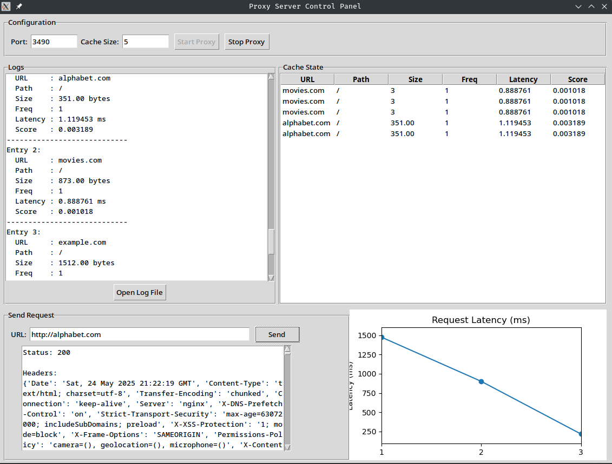

# 🔒 Adaptive Deep-Learning Proxy Server

A high-performance, multithreaded C-based proxy server for HTTP and HTTPS with real-time, privacy-preserving malicious URL detection using a hybrid deep learning model. Features transparent TLS interception, a dynamic GDSF cache, and a Python microservice for deep learning classification. Includes a Tkinter-based GUI for control and monitoring.

---

## 🚀 Features
- **Multithreaded Proxy:** Handles thousands of concurrent HTTP/HTTPS clients using POSIX threads.
- **Transparent HTTPS Interception:** Dynamically generates and signs certificates for MITM inspection of encrypted traffic (no client config needed).
- **Deep Learning URL Classification:** Integrates a Python microservice (CNN-LSTM, trained on Kaggle Malicious URLs) for real-time detection of phishing, malware, and defacement URLs.
- **Dynamic GDSF Cache:** High-performance cache with Greedy Dual Size Frequency (GDSF) eviction, ranking by frequency, latency, and size.
- **Privacy-Preserving:** Only URLs are analyzed—no user credentials or content are processed. Logging supports anonymization and encryption.
- **GUI Control Panel:** Tkinter GUI to start/stop the proxy, view logs, inspect cache state, and plot request latencies.
- **Performance:** >800 requests/sec, sub-25ms latency, ~96% cache hit ratio on commodity hardware.

---

## 🏗️ System Architecture


**Components:**
- **Proxy Server (C):** Handles all client traffic, MITM for HTTPS, manages threads, cache, and communication with the microservice.
- **Deep Learning Microservice (Python):** Loads CNN-LSTM model, classifies URLs via REST API.
- **Cache & Logging:** Thread-safe, GDSF-evicted cache; detailed, privacy-aware logs.
- **GUI (Tkinter):** For easy control, monitoring, and visualization.

**Data Flow:**
1. Client request → Proxy intercepts (decrypts if HTTPS)
2. URL extracted → Cache checked
3. If not cached, URL sent to microservice for classification
4. Proxy allows/blocks request, logs decision

---

## 🛠️ Technologies Used
- **C (POSIX, OpenSSL, pthreads, sockets)**
- **Python (Flask/FastAPI, Keras/TensorFlow, scikit-learn, Tkinter, matplotlib)**
- **OpenSSL:** For dynamic certificate generation and TLS interception
- **Linux/Ubuntu (GCC)**

---

## ⚡ Quick Start

### 1. Build the Proxy
```bash
cd proxy
# Compile all C files (ensure OpenSSL dev libs are installed)
gcc EntryClient.c FetchServer.c Cache.c CallDns.c ClientToServer.c CacheData.c MitmCert.c -o proxy_server -lpthread -lssl -lcrypto
```

### 2. Start the Deep Learning Microservice
- (See `gui/` or your own Python server; must expose a REST API for URL classification)

### 3. Run the Proxy
```bash
./proxy_server
```

### 4. Launch the GUI
```bash
cd ../gui
python3 gui.py
```

---

## 🌐 Usage
- Set your browser/system proxy to `localhost:3040` (or the port you configured)
- Supports both HTTP and HTTPS (install the generated CA certificate in your browser for HTTPS)
- Use the GUI to start/stop the proxy, view logs, inspect cache, and plot latencies

---

## 🧠 Deep Learning Model
- **Model:** Hybrid CNN-LSTM, trained on Kaggle Malicious URLs Dataset
- **Accuracy:** 97.45% (test set)
- **Latency:** 6–9ms per URL (microservice), <25ms end-to-end
- **Classes:** benign, phishing, malware, defacement
- **Privacy:** Only URLs are sent for classification

---

## 🗄️ Cache
- **Eviction Policy:** Greedy Dual Size Frequency (GDSF)
- **Score:** `(frequency × latency) / response_size`
- **Hit Ratio:** ~96% in real-world scenarios

---

## 🔒 Privacy & Security
- Only URLs are analyzed (no content, credentials, or cookies)
- Logs can be anonymized, hashed, and encrypted
- All sensitive operations are in-memory or over secure channels

---

## 🖥️ GUI Features
- Start/stop proxy server
- View real-time logs
- Inspect cache state (URL, path, size, freq, latency, score)
- Send test requests and view responses
- Plot request latencies

---

## 🧪 Sample Output


---

## 📋 License & Credits
- For research/educational use only
- Deep learning model: Kaggle Malicious URLs Dataset
- C, Python, OpenSSL, Tkinter, matplotlib, Flask/FastAPI, Keras/TensorFlow

---


