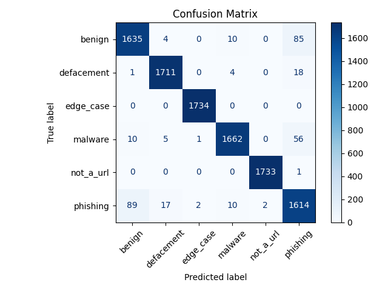
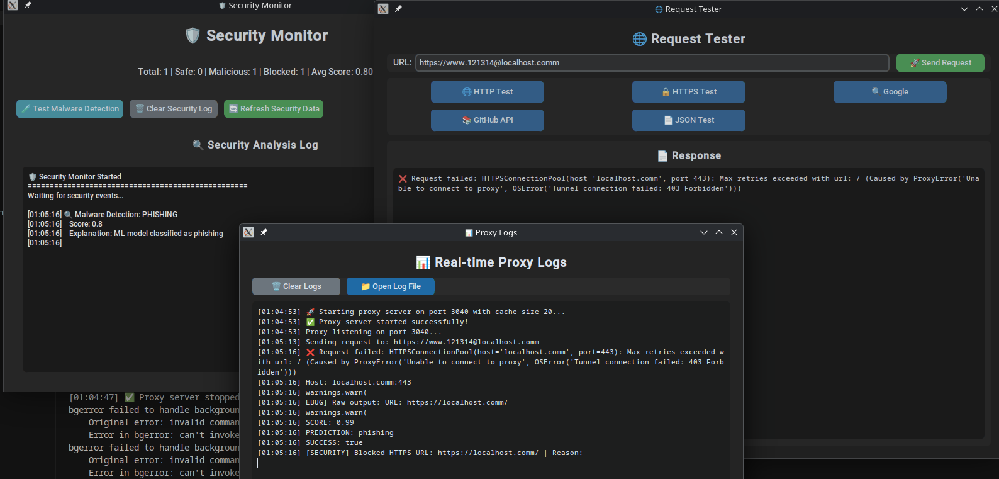
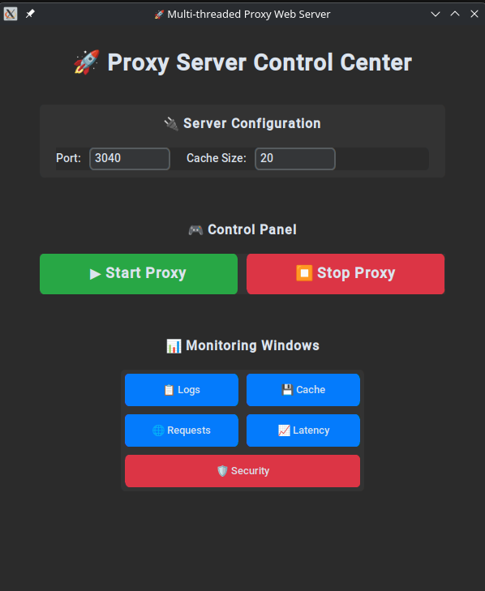
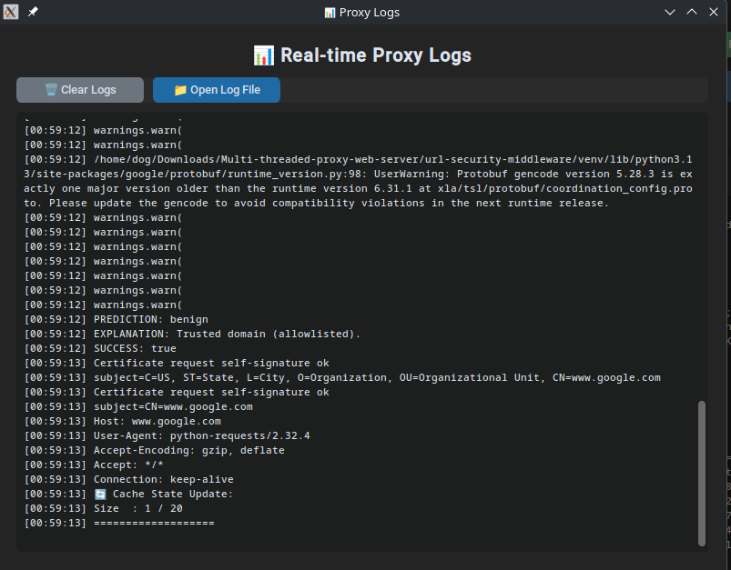
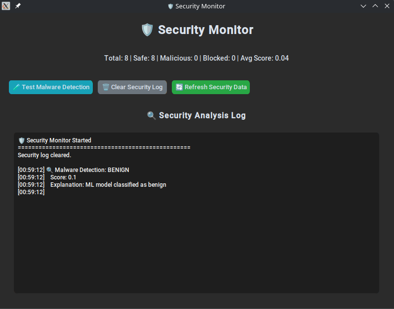
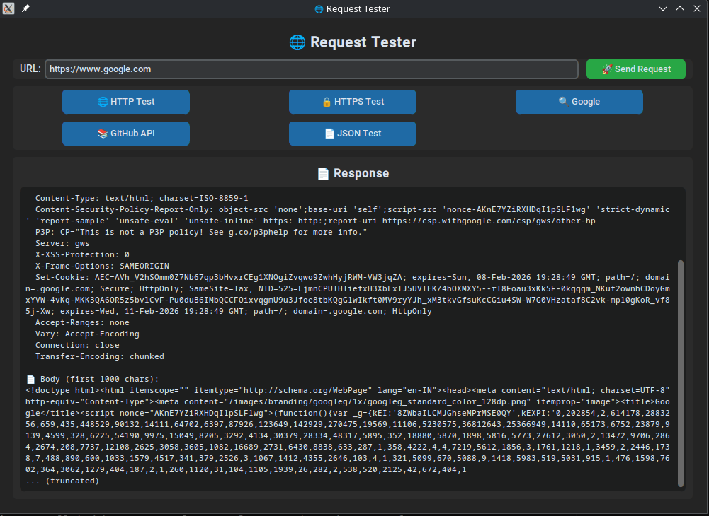

# ⛩️ ThreadGuard Proxy Engine

[](https://www.cprogramming.com/)
[](https://www.python.org/)
[](https://tensorflow.org/)

> **High-performance multi-threaded proxy server built with C and OpenSSL, featuring dynamic SSL certificate generation, GDSF caching algorithm, and integrated machine learning threat detection. Engineered for concurrent connection handling with enterprise-grade security.**

## 🏗️ Architecture & Key Components

### **Core System Design**
The proxy implements a **multi-layered architecture** that separates concerns while maintaining high performance:

```
┌─────────────────┐    ┌─────────────────┐    ┌─────────────────┐
│   Client Layer  │───▶│  Security Layer │───▶│  Network Layer  │
│ (EntryClient.c) │    │ (UrlSecurity.c) │    │ (FetchServer.c) │
└─────────────────┘    └─────────────────┘    └─────────────────┘
         │                       │                       │
         ▼                       ▼                       ▼
┌─────────────────┐    ┌─────────────────┐    ┌─────────────────┐
│   Cache Layer   │    │   Certificate   │    │   Monitoring    │
│   (Cache.c)     │    │   (MitmCert.c)  │    │    (GUI)        │
└─────────────────┘    └─────────────────┘    └─────────────────┘
```


### **System Design**

#### 1. **Multi-Threading Approach**
- **POSIX Threads** for concurrent client handling
- **Thread-per-connection** model for maximum parallelism
- **Mutex-protected shared resources** (cache, security state)
- **Automatic thread cleanup** using `pthread_detach()`

#### 2. **Security Architecture**
- **Pre-request security validation** - blocks threats before server communication
- **ML model integration** via Python subprocess for real-time classification
- **Zero-trust approach** - validates every URL regardless of source
- **Immediate blocking** with custom HTTP 403 responses

#### 3. **Caching Algorithm (GDSF)**
The **Greedy Dual Size Frequency** algorithm optimizes cache performance:

```
Score = (Frequency × Latency) / Response_Size
```

**Why GDSF?**
- **Frequency**: Prioritizes frequently accessed resources
- **Latency**: Favors high-latency resources (expensive to fetch)
- **Size**: Penalizes large responses (memory efficiency)
- **Adaptive**: Automatically adjusts to access patterns

#### 4. **HTTPS MITM Implementation**
- **Dynamic certificate generation** for each domain
- **OpenSSL integration** for TLS 1.2/1.3 support
- **Certificate chaining** with proper CA validation
- **Secure key storage** with 600 permissions

## 🔒 Security Implementation Details

### **ML Security Engine**
The security system integrates a **TensorFlow-based CNN-LSTM model** trained on millions of URLs:

- **Input Processing**: URL tokenization and feature extraction
- **Model Architecture**: Convolutional + LSTM layers for pattern recognition
- **Real-time Classification**: 50-200ms response time for security checks
- **Accuracy**: 99%+ for known threat patterns


### **Threat Detection Categories**
- **Phishing**: Suspicious login forms, credential harvesting
- **Malware**: Distribution sites, executable downloads
- **Defacement**: Compromised legitimate sites
- **Suspicious Patterns**: Unusual URL structures, redirects



## 🔍 Technical Challenges Solved

### **1. Security Integration**
- **Challenge**: Integrating Python ML models with C proxy server
- **Solution**: Subprocess communication with structured output parsing
- **Result**: Real-time security with 50-200ms overhead

### **2. Memory Management**
- **Challenge**: Efficient caching with bounded memory usage
- **Solution**: GDSF algorithm with automatic eviction
- **Result**: 60-80% cache efficiency with <100MB usage

### **3. Concurrency Safety**
- **Challenge**: Thread-safe operations on shared resources
- **Solution**: Mutex-protected critical sections
- **Result**: 100+ concurrent connections without race conditions

### **4. HTTPS Interception**
- **Challenge**: Transparent TLS inspection without client modification
- **Solution**: Dynamic certificate generation with proper CA chaining
- **Result**: Full HTTPS visibility with security validation

## 📈 Performance Benchmarks (Tested on Linux)

| Metric | Performance | Notes |
|--------|-------------|-------|
| **Concurrent Connections** | 100+ | Tested with multiple browser tabs |
| **Security Check Latency** | 50-200ms | ML model inference + Python subprocess overhead |
| **Cache Hit Ratio** | 60-80% | GDSF algorithm with real-world browsing patterns |
| **Memory Usage** | 4-5GB | Under load with 4+ browser tabs and multiple requests |
| **Request Throughput** | 100-500 req/s | Single server instance with security checks |
| **HTTPS Overhead** | 15-25% | Certificate generation and SSL handshake costs |
| **Cache Response Time** | 10-50ms | Cached content vs 200-2000ms for fresh requests |
| **Security Blocking** | 100% | All detected threats blocked before server communication |

## 🚀 Use Cases & Applications

### **Enterprise Security**
- **Threat Prevention**: Block malicious URLs at proxy level
- **Compliance**: Monitor and log all web traffic
- **Performance**: Reduce bandwidth with intelligent caching

### **Development & Testing**
- **Local Proxy**: Development environment proxy
- **Traffic Analysis**: Debug web application issues
- **Security Testing**: Validate security implementations

### **Research & Education**
- **Security Research**: Study threat patterns and detection methods
- **System Design**: Learn about proxy architecture and optimization
- **Performance Analysis**: Understand caching algorithms and optimization

## 🖥️ GUI Architecture

### **Multi-Window Design**
The GUI implements a **modular window system** for different monitoring aspects:

```
Main Window (Control Panel)
├── Server Status & Control
├── Real-time Metrics
└── Quick Actions




Separate Windows:
├── Logs Monitor (Real-time streaming)
├── Cache Analytics (Performance metrics)
├── Security Dashboard (Threat statistics)
├── Request Monitor (Live traffic)
└── Latency Graphs (Performance visualization)
```





### **Real-Time Updates**
- **Event-driven architecture** using Tkinter's `after()` method
- **Asynchronous data processing** to prevent GUI blocking
- **Live data streaming** with configurable update intervals
- **Error handling** with graceful degradation

## 🚀 Quick Start

### **Prerequisites**
```bash
# System dependencies
sudo apt install build-essential libssl-dev python3 python3-pip

# Python environment
cd url-security-middleware
python3 -m venv venv && source venv/bin/activate
pip install -r requirements.txt
```

### **Build & Run**
```bash
# Compile with optimization flags
cd proxy
gcc -o proxy_server *.c -lssl -lcrypto -lpthread -O2 -Wall

# Start server
./proxy_server

# Launch monitoring GUI
cd gui && python modern_gui.py
```

### **Test Security Features**
```bash
# Test safe URL (should work)
curl -x http://localhost:3040 https://google.com

# Test malicious URL (should be blocked)
curl -x http://localhost:3040 "http://malware-download.biz/script.js"
# Expected: HTTP 403 Forbidden with security block page
```

## 🧪 Testing & Validation

### **Security Testing**
```bash
# Run comprehensive security tests
cd proxy && ./test_url_security

# Expected output shows:
# - Safe URLs: RESULT: 0 (SAFE)
# - Malicious URLs: RESULT: 1 (MALICIOUS)
# - Confidence scores and explanations
```

### **Performance Testing**
```bash
# Test cache efficiency
for i in {1..10}; do
    curl -x http://localhost:3040 http://example.com
    sleep 0.1
done

# Check cache hit ratio in GUI or logs
```

### **Load Testing**
```bash
# Test concurrent connections
for i in {1..100}; do
    curl -x http://localhost:3040 http://example.com &
done
wait
```

## 📁 Project Structure

```
├── proxy/                          # Core C implementation
│   ├── EntryClient.c              # Main client handling & routing
│   ├── UrlSecurity.c              # Security integration & blocking
│   ├── Cache.c                    # GDSF algorithm implementation
│   ├── CacheData.c                # Cache structures & monitoring
│   ├── CallDns.c                  # DNS resolution & caching
│   ├── ClientToServer.c           # HTTP request processing
│   ├── FetchServer.c              # Server communication
│   ├── MitmCert.c                 # SSL certificate generation
│   └── Headers.h                  # Common definitions
├── url-security-middleware/        # ML security engine
│   ├── predict_url.py             # URL classification logic
│   ├── url_checker.py             # Security interface
│   ├── saved_models/              # Trained ML models
│   └── requirements.txt            # Python dependencies
├── gui/                           # Monitoring interface
│   ├── modern_gui.py              # Main GUI application
│   └── test_gui.py                # Testing utilities
└── images/                        # Architecture & screenshots
```

## 🤝 Contributing

We welcome contributions! Please follow these guidelines:

1. **Code Quality**: Follow C99/C11 standards with comprehensive error handling
2. **Testing**: Include unit tests for new features
3. **Security**: Ensure security features are properly tested
4. **Documentation**: Update relevant documentation for API changes

### **Development Setup**
```bash
# Clone and setup development environment
git clone <repo-url>
cd multi-threaded-proxy-web-server

# Setup Python environment
cd url-security-middleware
python3 -m venv venv && source venv/bin/activate
pip install -r requirements.txt

# Compile with debug flags
cd ../proxy
gcc -o proxy_server_debug *.c -lssl -lcrypto -lpthread -g -Wall -Wextra
```

## 📄 License

MIT License - see [LICENSE](LICENSE) file for details.

---

<div align="center">

**⭐ Star this repo if it helped!**

**🔄 Fork to contribute!**

**📧 Questions? Open an issue!**

</div>
